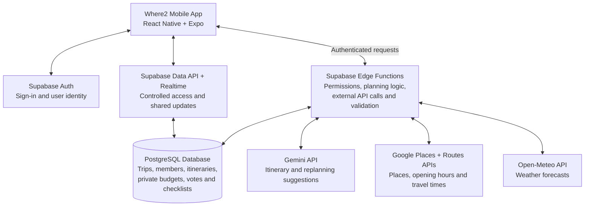

# 🌍 Where2 by Number 1
**Where2** is an AI-assisted collaborative travel planning platform designed to make planning, managing, and adapting a trip simpler for both solo and group travellers.

**Team**: JOEL CHONG XUE JIAN, LIM LI WEN, LAU ZI YEE

**Problem Statement**: Travel Planner 

**Video Presentation**: 

**Presentation Slides**: [https://canva.link/1w5xxis5cv063uo](https://canva.link/1w5xxis5cv063uo)

---

## 1.0 Project Overview

### 🚩 1.1 Problem Statement

Despite the large number of travel applications available today, travel planning remains a fragmented and time-consuming process. Travellers often need to coordinate destinations, activities, schedules, budgets, transportation, travel documents, and personal preferences across multiple platforms.

The challenge becomes even greater for group travellers, where differences in schedules, budgets, interests, travel styles, and personal preferences require significant coordination and compromise before an itinerary can be finalized.

Furthermore, unexpected situations such as poor weather, transportation delays, attraction closures, or changes in group plans can quickly make a carefully prepared itinerary ineffective, forcing travellers to manually reorganize their plans during the trip.

The main stakeholders are **solo travellers, groups of friends, and families** who need a simpler way to plan, organize, coordinate, and adapt their trips.

Existing platforms such as **Trip.com** and **Wanderlog** already provide extensive travel planning capabilities. Trip.com offers integrated booking, itinerary planning, destination information, and AI-assisted travel features, while Wanderlog provides itinerary management, group collaboration, expense tracking, and trip organization tools.

However, travellers may still face challenges when trying to reconcile different group members' preferences, budgets, schedules, and priorities into a single plan, especially when unexpected disruptions occur during the trip. This creates an opportunity for a platform that focuses more deeply on **group decision coordination and adaptive replanning**, while still bringing important planning information together in one place.

Therefore, there is a need for a unified travel platform that combines **AI-assisted itinerary planning, collaborative trip management, budgeting, travel preparation, group preference coordination, and adaptive replanning** into a more connected travel-planning experience.

---

### 💡 1.2 Our Solution

Where2 is an AI-assisted travel platform designed to bring the entire travel planning experience into one place.

Instead of forcing travellers to piece together plans across multiple apps, Where2 helps turn scattered ideas, preferences, budgets, and group decisions into one connected and manageable journey.

It gives travellers the flexibility to stay in control while using AI to reduce the time, effort, and stress involved in planning and adapting a trip.

Whether travelling solo or with others, Where2 aims to make every stage of the journey **simpler, more coordinated, and easier to adjust when plans change**.

---

### 1.3 Features

#### 🤖 Feature 1: AI-Assisted Travel Planner

The AI-Assisted Travel Planner generates personalized itineraries based on:

* Destination
* Travel dates
* Group size
* Budget
* Travel style
* Preferred pace
* Places or activities the user already wants to visit

If users already have places in mind, the AI organizes them into a practical itinerary and may recommend additional activities where appropriate.

If users are starting from scratch, the AI can generate the trip based on their travel preferences.

All generated itineraries remain editable, allowing users and their travel companions to:

* Add activities
* Remove activities
* Reorder activities
* Replace activities

The AI therefore acts as a **planning assistant rather than replacing the traveller's role in planning**.

##### Trip Preparation Dashboards

| Dashboard                 | Description                                                                                                                                                 |
| ------------------------- | ----------------------------------------------------------------------------------------------------------------------------------------------------------- |
| 🎒 **Luggage Packing**    | Generates a suggested packing checklist based on the destination, trip duration, expected weather, and planned activities.                                  |
| 💰 **Budget**             | Displays the estimated total trip budget with spending breakdowns by day and category such as accommodation, transportation, food, and activities.          |
| 🚨 **Emergency Contacts** | Provides quick access to important emergency information such as local emergency numbers, police services, and medical assistance.                          |
| 📄 **Travel Documents**   | Provides a centralized location for important travel documents such as flight tickets, boarding passes, accommodation confirmations, and booking documents. |
| 🌦️ **Weather Forecast**  | Displays expected weather conditions during the trip to help users prepare and adjust weather-sensitive activities when necessary.                          |

---

#### 👥 Feature 2: Collaborative Trip Management

For group travel, users can invite their travel companions to access the same trip and collaboratively manage a shared itinerary.

Users can view and manage:

* Past trips
* Upcoming trips
* Ongoing trips

Instead of coordinating changes across multiple group chats, notes, or planning applications, everyone can work from a **single, up-to-date itinerary**.

This combines the efficiency of AI-assisted planning with the flexibility of collaborative decision-making.

---

#### 🔄 Feature 3: Adaptive AI Replanning

Travel plans do not always go according to plan.

Unexpected situations such as:

* Poor weather
* Transportation delays
* Attraction closures
* Schedule changes
* Unavailable activities

can make parts of an itinerary impractical.

Users can inform Where2 about the disruption, and the AI will generate suitable alternatives while considering the existing itinerary, remaining time, budget, and user preferences.

Where possible, unaffected activities are preserved so travellers do not need to rebuild their entire trip manually.

---

#### ✈️ Feature 4: Trip Sharing & Travel Inspiration

Users can share their completed trips and travel experiences with other users on the platform.

Shared trips can include:

* Destinations visited
* Activities completed
* Personal recommendations
* Reviews and experiences

This allows travellers to discover destinations through real travel experiences and use them as inspiration for their own future journeys.

Completed trips therefore continue to provide value even after the journey ends.

---

## 2.0 Ideation & Process

### 2.1 Ideas We considered 
The team explored several possible features for the travel-planning application. After discussion and mentor feedback, we prioritised ideas that directly support the main travel journey, while removing or simplifying features that increased complexity without adding enough value.

| **Idea** | **Why it was dropped / kept** |
|---|---|
| **AI Trip Planning (Chosen)** | Kept because it reduces the time and effort required to manually organise destinations, routes and daily schedules. The AI can generate a complete itinerary based on the user's trip details and preferences. |
| **Destination Discovery & AI Inspiration (Chosen)** | Kept to help users discover suitable destinations, especially when they are unsure where to go. Users can search destinations or ask AI for recommendations based on their travel interests and mood. |
| **Personalised Travel Preferences (Chosen)** | Kept because different travellers have different interests, travel pace, budgets and special requirements. These preferences help the AI generate a more suitable itinerary. |
| **Must-go & Nice-to-have Places (Chosen)** | Kept because users may already have specific places they want to visit. Must-go places are prioritised, while Nice-to-have places are included when time and travel distance allow. |
| **Editable Itinerary (Chosen)** | Kept to maintain flexibility after the itinerary is generated. Users can add, delete, reorder and adjust activities based on their needs. |
| **Collaborative Group Planning (Chosen)** | Kept because group travellers may have different preferences. The app allows members to compare preferences, vote between options and make travel decisions together. |
| **Traveller Reviews & Shared Trip Plans (Chosen)** | Kept because users can gain inspiration from other travellers' experiences, discover places and view useful trip plans. |
| **Trip Readiness Tools (Chosen)** | Kept to help users prepare before travelling by checking important areas such as travel documents, packing, weather and budget. |
| **Emergency Assistance (Chosen)** | Kept because travellers may face unexpected situations during a trip. The app provides emergency contacts, nearby hospitals, embassy information and location-sharing options. |
| **Ongoing Trip Mode (Chosen)** | Kept to support users during the actual trip by showing the current schedule, activity status and directions. |
| **AI Re-planning (Chosen)** | Kept because travel plans may change due to delays, missed activities or unexpected situations. AI can rearrange the itinerary while protecting important Must-go places. |
| **Manual Planning Mode (Dropped)** | Dropped because a separate manual-planning flow would make the planning process more complicated and create additional screens. Instead, users can directly tell the AI which places they must visit, and the AI will include them when generating the itinerary. |
| **Social Media Sharing Template (Dropped)** | Dropped because the application already contains many core features. Adding an automatic social-media template generator would increase the scope and complexity of the project, while contributing less to the core travel-planning experience. |

After evaluating the ideas, the team focused on features that support the full travel journey: discovering destinations, planning the trip, collaborating with others, preparing before departure and adapting the itinerary during the trip.

### 2.2 Ideation Boards  
#### 1. Mind Map

This mind map shows the key travel planning problems identified during our team discussions.

#### 2. Flowchart

This flowchart shows the trip planning process and solution flow designed for Where2.

#### 3. Crazy Eights

The Crazy Eight exercise was used to quickly generate and compare different feature concepts. The team explored possible solutions before deciding which ideas should be developed further and which should be removed or simplified.

#### 4. Low-Fidelity User Flow
[View Low-Fidelity Prototype](travel-planner-low-fidelity-prototype.pdf)

After selecting the main ideas, the team organised them into an end-to-end low-fidelity user flow covering **Explore → Plan → Collaborate → Prepare → Re-plan**. The flow shows how users move from destination discovery and AI trip creation to itinerary management, trip preparation and AI-assisted re-planning during the trip. The low-fidelity prototype also includes key flows such as destination discovery, editable itineraries, travel-group decisions, trip tools and ongoing-trip assistance. 

### 2.3 Mentor Consultation 
| **Date** | **Mentor** | **Feedback Received** | **What Was Changed** |
|---|---|---|---|
| **4 Sep 2026** | **Iris Yan** | 1. The overall UI/UX design was considered satisfactory.  2. We were encouraged to add unique features that are not commonly available in existing travel applications. | 1. We added destination reviews to help users understand whether a destination is more popular among local residents or mainly visited by tourists.  2. This helps users choose places that better match their travel preferences. |
| **10 Sep 2026** | **Teng Wei Herr** | 1. We initially prepared two project tracks, and the mentor recommended that we focus on Track 2.  2. For Track 2, we were encouraged to introduce more distinctive features. The mentor also suggested referring to Indie App for inspiration and research.  3. We were advised to prepare both a fixed prototype and a clickable demo, with Next.js suggested for developing the interactive version. | 1. We decided to focus fully on Track 2 and further develop the travel-planning application.  2. We added an Explore page to make the application more engaging. We also introduced an interactive Earth concept to improve the visual experience and make destination exploration more interesting.  3. We redesigned several application screens and started developing the clickable prototype using Next.js. |
| **10 Sep 2026** | **Lim Zi Yang** | 1. The mentor responded positively to features such as the Emergency screen and Documentation screen.  2. For the documentation, we were advised to include a direct comparison with existing travel applications to demonstrate how our application provides additional or improved features.  3. We were encouraged to conduct further research on the technical implementation and suitable technology stack. Supabase was suggested as one possible technology for backend and database development. | 1. We added a comparison between our application and existing travel applications in the documentation to clearly highlight our unique features and advantages.  2. We conducted further research on the technology stack required to develop the application.  3. We started evaluating suitable technologies, including Supabase, for database management, backend services, authentication, and future implementation of the application. |

---
## 3.0 Design & Prototype: 
### Clickable UI Prototype： https://www.figma.com/proto/zjT2y60LwSmcQCQWGzsMUY/Where2-%E2%80%94-High-Fidelity-UI?node-id=109-3&t=DqOGiOjj4esQVtOe-1&scaling=min-zoom&content-scaling=fixed&page-id=0%3A1&starting-point-node-id=31%3A46
### Full UI Screens： https://www.figma.com/design/zjT2y60LwSmcQCQWGzsMUY/Where2-%E2%80%94-High-Fidelity-UI?node-id=0-1&t=louuAFjJCyWyizkr-1
### Key Screens: 

### 

---
## 4.0 What Makes It Different 
### 1. What Makes It Different

Where2 proposes a travel-planning experience centred on individual privacy, group decisions, and preserving travellers’ priorities when plans change. Its originality lies in connecting these needs through specific workflows.
Existing solutions already cover substantial parts of the travel journey. Wanderlog provides collaborative itineraries, budgeting, expense splitting, and preparation tools. Trip.com combines booking services with personalised AI planning and shared itinerary editing. Where2 therefore focuses on the following proposed improvements rather than claiming that these basic functions are new.

### 2. Private personal budgets within a shared trip

Each traveller can enter a daily or total budget, specify which spending categories it covers, and keep the exact amount hidden from companions. Where2 uses these inputs to inform planning suggestions while the group collaborates on one itinerary.
The twist: travellers can communicate their financial constraints to the system without disclosing their exact budget to the group or maintaining a separate private trip.
This addresses a documented Wanderlog limitation: its support account has discussed adding an option to hide the budget section and suggested View Only sharing as a workaround. View Only sharing serves a different purpose from collaboratively editing the same trip.

### 3. Group decisions with visible trade-offs

Where2’s Vote & Compare feature allows members to compare activities by travel time, estimated cost, and alignment with individual interests before voting. It also highlights members whose Must-go places remain unscheduled.
The twist: collaboration includes a structured way to discuss compromises. For example, members can see that a museum costs less and suits two travellers’ interests, while a shopping stop requires less travel time. This is designed to make group decisions clearer and reduce repeated discussion.

### 4. Must-go priorities carried into replanning

Users can identify attractions as Must-go or Nice-to-have before generating their itinerary. Where2 plans around those priorities and existing bookings. If a priority attraction is missed, the app offers suggestions for fitting it into the remaining trip, with changes presented for review.
The twist: the app remembers which experiences matter when helping travellers adjust. For example, a missed night market could be moved to the following evening, with another flexible activity rescheduled.

### 5. Connected preparation and itinerary checks

Where2’s Trip Readiness overview brings together document status, packing progress, weather concerns, and unscheduled priorities. Supporting features include missing-meal checks and weather-linked suggestions for items absent from the packing list.
The twist: the proposed experience connects information to actions—for example, highlighting expected rain alongside a missing umbrella, or identifying a Must-go attraction that still needs a time slot.

| Area | Wanderlog: confirmed capabilities | Trip.com: confirmed capabilities | Where2: proposed approach |
|---|---|---|---|
| **Budgeting** | Tracks expenses, splits costs, and provides category/day breakdowns and currency conversion. Budget-sharing limitations have been acknowledged by support. | Its published group-planning guide describes using budget inputs when planning a trip. | Private daily or total personal budget inputs within a collaborative trip. |
| **Group planning** | Real-time collaborative itinerary editing. | TripGenie allows multiple users to create and edit itineraries together. | Shared planning with activity voting and explicit comparisons of preference fit, cost, and travel time. |
| **Itinerary planning** | AI assistance and daily route optimisation, including reviewing and reverting changes. | Personalised itineraries based on destinations, trip length, preferences, and pace, with booking integration. | Must-go/Nice-to-have priorities, fixed booking commitments, and itinerary completeness checks. |
| **During-trip support** | AI assistance and flight-status information. | Flight updates, hotel check-in alerts, and AI support for itinerary and booking questions. | A dedicated missed-Must-go flow that proposes adjustments to the remaining itinerary. |

---

## 5.0 Technical Architecture & Feasibility
### 1. Tech stack

Where2 will be developed as a mobile application, with Figma used for UI design and prototyping. The proposed development stack is React Native with Expo for the frontend and Supabase for the backend and database.
| Component | Proposed technology | Why we chose it | Expected constraints |
|---|---|---|---|
| **UI/UX design** | **Figma** | Allows the team to design screens, maintain consistent components, and test navigation through clickable prototypes before implementation. | A Figma prototype does not implement the database, AI, or working application logic. These must be developed separately. |
| **Mobile frontend** | **React Native + Expo + TypeScript** | Supports Android and iOS development through a shared codebase and can implement our questionnaire, itinerary, voting, and readiness screens. | Platform-specific testing is still required. |
| **Backend** | **Supabase Edge Functions** | Handles itinerary generation, replanning, external API requests, and validation without maintaining a separate server. TypeScript can be used across the frontend and backend. | Function execution limits and slow external requests may cause timeouts. We will limit request size and provide retry options. |
| **Database** | **Supabase PostgreSQL** | Stores trips, members, preferences, activities, private budgets, votes, and preparation checklists in connected tables. | Database access policies must be configured carefully to separate shared trip information from private personal information. |
| **Authentication and collaboration** | **Supabase Auth + Realtime** | Provides user sign-in and synchronises saved itinerary changes and votes between travellers. | Updates require connectivity. Version checks will prevent outdated edits from silently overwriting newer changes. |
| **AI service** | **Gemini API** | Generates structured itinerary drafts and proposes changes based on preferences, priorities, and reported disruptions. | AI can produce inaccurate suggestions. Backend validation and user review are necessary before accepting a plan. |
| **Places and travel information** | **Google Places API + Routes API** | Supplies recognised destinations, attraction information, available opening hours, and estimated travel times. | Billing, quotas, attribution requirements, and data-storage restrictions apply. Information may be incomplete or change. |
| **Weather service** | **Open-Meteo API** | Provides forecasts for the weather page and weather-linked packing suggestions. | Forecasts are available only for a limited future period. Free-service usage restrictions must be considered. |
| **Hosting and distribution** | **Supabase Cloud + Expo EAS Build** | Supabase hosts the database and backend services. EAS produces installable mobile builds for testing and distribution. | Service quotas and build allowances apply. Public app-store distribution requires additional account setup and review. |

Hosting approach: the interface runs on the traveller’s phone, while Supabase hosts the online services. External API secrets remain in Edge Functions, which act as the API proxy; a separate proxy server is unnecessary.

### 2. System architecture diagram

## 3. How the system works

### 1. Itinerary generation and replanning

The app collects trip details, travel preferences, personal budget settings, existing bookings, and Must-go/Nice-to-have places. The backend retrieves relevant place information and requests an AI-generated itinerary.

The backend checks the draft for overlapping activities, changes to fixed bookings, and missing priority places. Users review the proposed itinerary before saving it. When a traveller reports a disruption or skips a Must-go activity, the system proposes changes to the remaining schedule.
If all requested activities cannot fit, Where2 highlights the conflict and asks the user to choose rather than silently removing a priority.

#### 2. Private budgets and shared planning
Personal budgets will be stored separately from shared itinerary information. Database access rules will restrict each budget to its owner, while authorised backend planning logic can use the input to inform suggestions. Shared responses will exclude individual budget amounts.

Supabase’s Row Level Security supports these access rules, but the team must implement and test them. Supabase access-control documentation
Connected Trip Readiness dashboard

The dashboard combines saved preparation status with simple checks:
- Incomplete document requirements appear as outstanding tasks.
- Packing progress is calculated from checked items.
- Unscheduled Must-go places appear as itinerary concerns.
- Forecast rain can trigger an umbrella suggestion if one is missing from the packing list.
These checks use application rules rather than AI. This keeps their behaviour predictable and reduces AI usage costs.

### 4. Build plan & scope
During the building phase, we plan to deliver one complete working journey: create a trip, generate and edit an itinerary, coordinate with companions, review preparation, and reschedule a missed Must-go activity.

To keep development realistic, the proposed demonstration scope is one supported city, trips of up to five days, and groups of up to four travellers. Solo travellers will use the same flow without group invitations or voting.

| Stage | What we will build | Demonstrable outcome |
|---|---|---|
| **1. Foundation** | Sign-in, trip creation, invitations, and saved preferences. | Two users can access the same trip while keeping personal budget amounts private. |
| **2. Itinerary planning** | The trip questionnaire, manually entered booking commitments, attraction selection, AI generation, and itinerary editing. | A user can generate, review, save, and modify a day-by-day plan. |
| **3. Budget and group decisions** | Personal budget settings, manually entered costs, activity voting, and comparisons of estimated cost, time, and preference fit. | Members can compare alternatives and apply their selected option. |
| **4. Connected preparation** | Document-status and packing checklists, a readiness overview, and weather-linked packing suggestions. | Completing preparation tasks updates the dashboard and clears relevant outstanding items. |
| **5. During-trip support** | Complete/skip controls, missed-Must-go prompts, and replanning previews. | A user can accept a revised itinerary while preserving completed activities and fixed bookings. |
| **6. Testing and delivery** | Android device testing, access-control checks, collaboration testing, and API failure handling. | The full journey works without exposing private budgets or losing saved plans when requests fail. |

